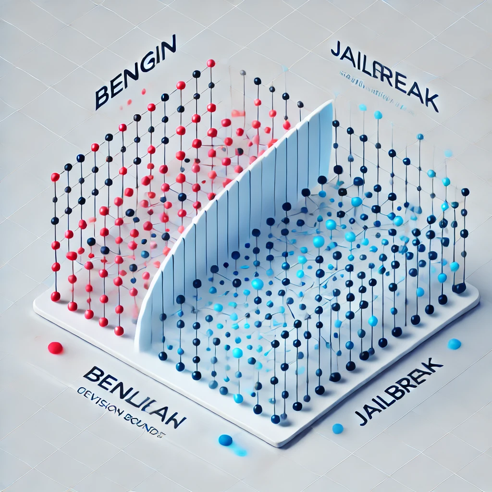
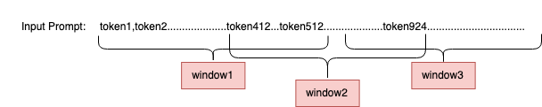

__I Update on 11.11.24 and had files that handle with long inputs:__

***- 6-fine_tune_pretrained_with_long_inputs.ipynb***

***- 7-test_my_hf_model_for_long_inputs.ipynb***

***- inference_long_inputs.py***

***- fast_api_service_for_long_inputs/ (docker app)***

# 0.Create Environments for each part

### 0.1. Create "qualifier-env" and install requirements.txt
#### For all notebooks except 3-custom_neural_network.ipynb 

```bash
conda create --name qualifier-env python=3.10

conda activate qualifier-env

pip install -r requirements.txt
```

### 0.2. Create "tf-qualifier-env" and install requirements-tf.txt(for tensorflow)
#### Just for 3-custom_neural_network.ipynb


```bash
conda create --name tf-qualifier-env python=3.10

conda activate tf-qualifier-env

pip install -r requirements-tf.txt
```

### 0.3. Create "inference-qualifier-env" and install requirements-tf.txt(for inference)
#### Just for inference.py 
```bash
conda create --name inference-qualifier-env python=3.10

conda activate inference-qualifier-env

pip install -r requirements-inference.txt
```

# 1. Notebooks
### 1.1. 1-EDA.ipynb -> env:"qualifier-env"
#### Process of exploring and understanding the data using statistical and visualization techniques, such as analyzing word distributions, identifying important features, and examining the structure of the data

### 1.2. 2-traditional_ML_approaches.ipynb (Task 1 + Task 2) -> env:"qualifier-env"
#### Creating and training of various ML models, such as Logistic Regression, Random Forest, Gradient Boosting, and more. Comparison between training on metadata features alone versus training with metadata features + TFIDF. first splits the dataset into training (80%) and validation (20%) sets then, training models using boosting techniques such as XGBoost and CatBoost.Performing hyperparameter tuning to select the best model, and generating metrics and a confusion matrix.Finally, saving, uploading, and evaluating the best model and preprocess pipeline.

### 1.3. 3-custom_Neural_Network.ipynb (Task 1 + Task 2) -> env:"tf-qualifier-env"
#### Creating and training Custom Neural Network model. first shuffles and splits the dataset into training (80%) and validation (20%) sets. Then tokenizes and pads the text data, while encoding labels for classification. A neural network model is defined and trained using the training set, with tuning hyperparameters(layer parmas) like embedding size, dense units, and dropout rate tested for optimal performance. The best model is selected based on validation accuracy. After training, the model is evaluated on a test set. A confusion matrix is plotted to visualize the model's performance. The model is used for predictions, providing a label and confidence score for each input text. Finally, Save the pipeline(that include the preprocess and model) and the model, if we want retrain so we uploaded just the model with previous pipeline.

### 1.4. 4-fine_tune_pretrained_transformer.ipynb (Task 1 + Task 2 + Task 3) -> env:"qualifier-env"
#### This code demonstrates the process of fine tune training a pretrained transformer model. It loads and preprocesses a dataset, renames columns, and applies a label mapping to convert categorical labels into numerical ones. The text is tokenized using the BERT tokenizer, and the dataset is split into training and validation sets. A pretrained BERT model is initialized and trained with the specified hyperparameters on our data(fine tune). After training, the model is evaluated using metrics like F1 score, accuracy, recall, and precision. Predictions are made on the test set, and a confusion matrix is visualized. The final model for inference is further fine-tuned by combining the training and validation datasets for additional training and check by metrics and tests. The model saved localy and load as pipeline. finally the model upload to my Hungging Face Hub -> https://huggingface.co/oranne55/qualifier-model3-finetune-pretrained-transformer

### 1.5. 5-test_my_hf_model.ipynb -> env:"qualifier-env"
#### Loading and check my model from Hungging Face.

### 1.6. 6-fine_tune_pretrained_with_long_inputs.ipynb (Task 1 + Task 2 + Task 3) -> env:"qualifier-env"
#### The code is similar to the section 1.4. Initially, we checked how many prompts contained more than 512 tokens. After that, we performed preprocessing and removed the rows containing more than 512 tokens. We then conducted training and evaluated metrics along with a confusion matrix. Finally, we wanted to test the model on prompts with no length restrictions, so we built the predict_long_text_with_preprocess function. This function processes a list of texts by first preprocessing and tokenizing each text. It splits long texts into chunks (512 tokens with 100 tokens overlap), classifies each chunk using a model, and checks if any chunk is classified as "jailbreak". The overlapping happens to maintain the connection between the different parts of the text. The final classification for each text is determined by whether any chunk contains "jailbreak." It then returns a list of predictions ("jailbreak" or "benign") for each text. The model is run on the available device (MPS or CPU).
The overlapping happens to maintain the connection between the different parts of the text.
#### Visual representation of the sliding window technique with overlapping (window_size=512, overlapping_size=100):


#### finally the model upload to my Hungging Face Hub -> https://huggingface.co/oranne55/qualifier-model4-finetune-pretrained-transformer-for-long-inputs

### 1.7. 7-test_my_hf_model_for_long_inputs.ipynb -> env:"qualifier-env"
#### Loading and check my model for long inputs from Hungging Face.

# 2. inference
#### The model used for inference is the one trained in Section 1.4.
### 2.1. infernce.py -> env:"inference-qualifier-env" (Task 3)
#### This Python script performs text classification using a pre-trained Hugging Face model.

#### * It checks if a GPU is available and selects it for processing if possible.
#### * It validates the input to ensure it's a non-empty string and doesn't exceed 20,000 characters.
#### * It measures the time (latency) taken to classify the input text.
#### * The script returns the classification label, confidence score, and latency.
#### * It accepts input through command-line arguments and prints the result.

#### To run it :
```bash
python inference.py "Your text to classify here"
```
#### Example of result: 
{'classification': 'benign', 'confidence': 0.9997623562812805, 'latency': 0.46270108222961426}

### 2.2. Deploy FastAPI Service Using Docker Image (Task 3-faster)
#### This service is a text classification API built with FastAPI. It uses a pre-trained transformer model to classify input text prompts, returning the predicted label, confidence score, and the latency of the inference process. The API is accessible via HTTP requests, and the service is exposed on port 8000 inside the Docker container, which is mapped to port 8000 on the host machine.

#### The image store in: https://hub.docker.com/repository/docker/oranne5/text-classification-qualifier-api

#### To pull the image and run it:
```bash
docker run -p 8000:8000 oranne5/text-classification-qualifier-api:v1
```

#### Open another terminal and post prompt and get response:
```bash
curl -X POST "http://localhost:8000/classify" -H "Content-Type: application/json" -d "{\"prompt\": \"Your text to classify here\"}"
```

#### Example of result(same example from 2.2. -> lower latency)
{"classification":"benign","confidence":0.9997623562812805,"latency":0.09252357482910156}

### 2.3. inference_long_inputs.py -> env:"inference-qualifier-env" (Task 3)
#### Same like 2.1. but also have handle with large prompt and do window slidind with over lapping.
```bash
python inference_long_inputs.py "Your text to classify here"
```

### 2.4. Deploy FastAPI Service Using Docker Image for long prompt input (Task 3-faster)
#### Same like 2.2. but also have handle with large prompt and do window slidind with over lapping.

#### The image store in: https://hub.docker.com/repository/docker/oranne5/text-classification-long-prompt-qualifier-api

#### To pull the image and run it:
```bash
docker run -p 8001:8001 oranne5/text-classification-long-prompt-qualifier-api:v1
```

#### Open another terminal and post prompt and get response:
```bash
curl -X POST "http://localhost:8001/classify" -H "Content-Type: application/json" -d "{\"prompt\": \"Your text to classify here\"}"
```
#### Example of result(same example from 2.2. -> lower latency)
{"classification":"benign","latency":0.0012905597686767578}

# 3. Folders
### 3.1. datasets/
#### Contain test.csv and train.csv for simple loading


### 3.2. examples/
#### Conatin notebooks from web that hendle with jackhhao/jailbreak-classification dataset

#### 3.2.1. example1.ipynb - notebook that fine tune on jackhhao/jailbreak-classification dataset from: https://github.com/jackhhao/llm-warden/blob/main/src/train.py

#### 3.2.2. jailbreak-classifier_model_test.ipynb - notebook that check the model of jackhhao/jailbreak-classifier from: https://huggingface.co/jackhhao/jailbreak-classifier

### 3.3. fast_api_service/
#### Conatin all the files for build the image: text-classification-qualifier-api(Dockerfile, main.py, requirements.txt)

### 3.4. fast_api_service_for_long_inputs/
#### Conatin all the files for build the image: text-classification-long-prompt-qualifier-api(Dockerfile, main.py, requirements.txt, preprocessing.py)

#### 3.5. images/
#### Contain images for this project


